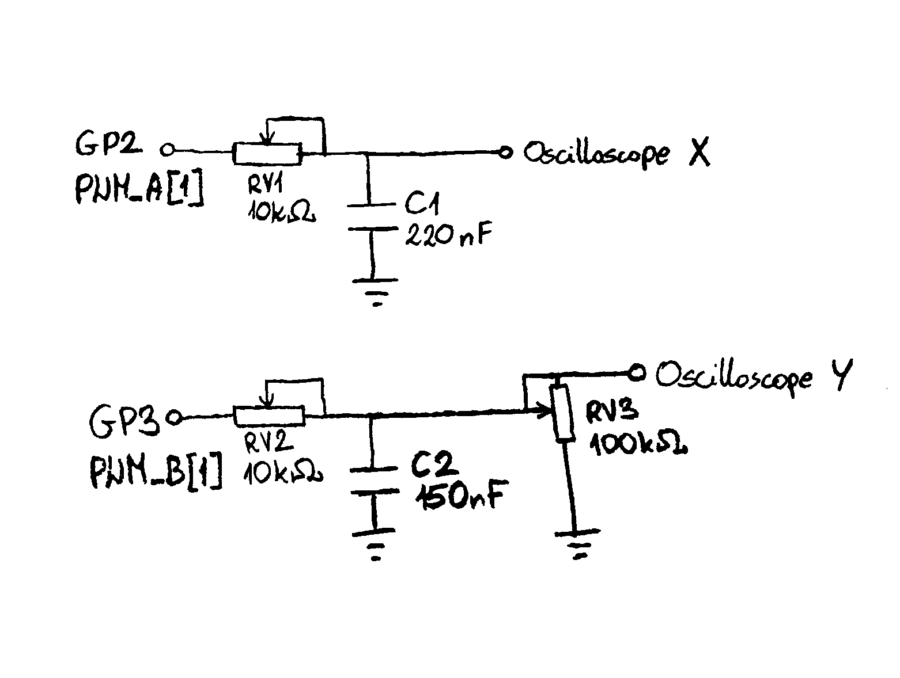
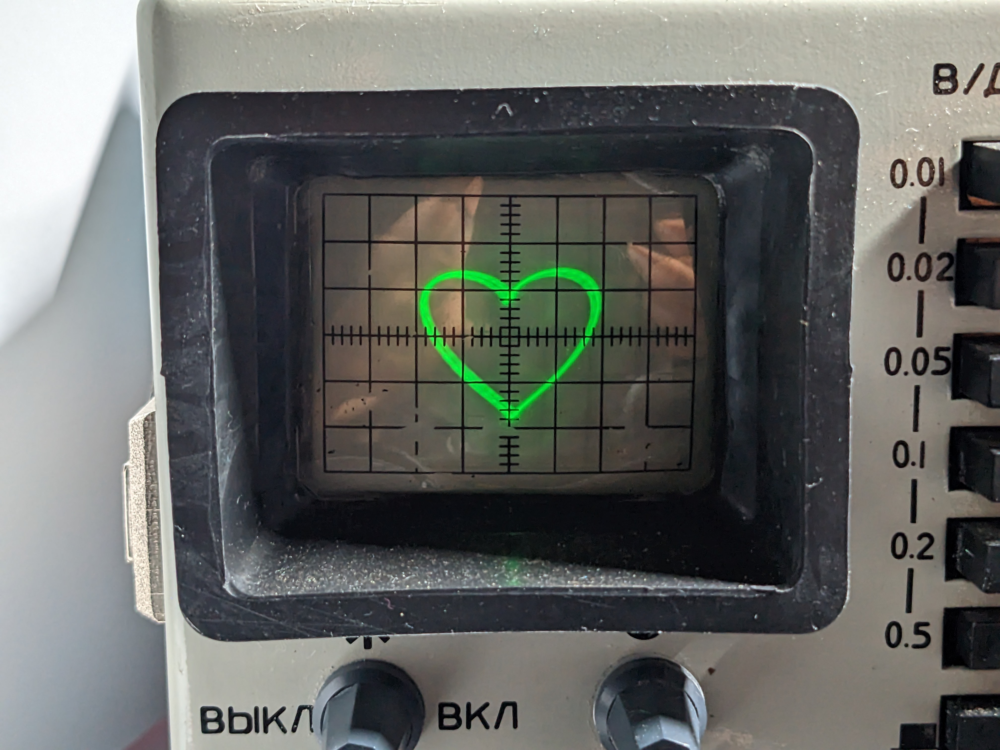

# Oscilloscope graphics
## Introduction
This repo contains the code used to perform drawings on the screen of my analog OML-3M oscilloscope. It utilizes the PWM outputs of a Raspberry Pi Pico, passing through passive low-pass RC filters, to control the X and Y position of the beam.

## Analog part

The above figure shows the schematic of the analog part of the project:
* The first PWM output, used to control the X coordinate, passes through a simple RC filter. Since the X input resistance of the OML-3M is rather low (10k), `RV1` acts also as a max signal level control.
* The second PWM output, used to control the Y coordinate, apart from passing through an RC filter needs to be lowered a bit to match the screen size (6 divisions, 0.5V per division). Since the input resistance of the Y input is high (1M), an additional variable resistor `RV3` is needed.
The circuit is far from perfect, but is good enough to achieve satisfactory results.

## Results
